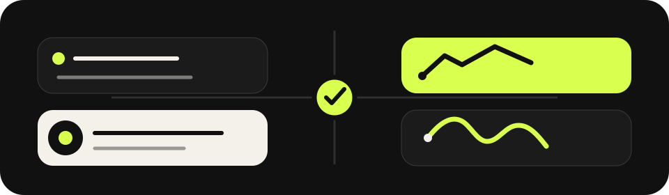

<div align="center">
  
  <h1>Habit Quest</h1>
  <p><strong>PRIVATE BY DEFAULT · OFFLINE · CALM · PLAYFUL</strong></p>
  <p>Un système local pour transformer des habitudes en actions visibles, en rituels durables et en progression personnelle.</p>
  <p>
    
    
    
    
    
  </p>
</div>


## L’idée

Habit Quest traite la progression comme un **système**, pas comme une série de notifications.

Une action réelle devient une preuve locale. Les preuves alimentent l’XP, les séries, la maîtrise et les quêtes. Les habitudes peuvent devenir des rituels, les rituels produisent des observations, et l’ensemble reste sur l’appareil.

> **Build a rhythm, not a streak.**

---

## Pourquoi Habit Quest

|                 |                                                                                       |
| --------------- | ------------------------------------------------------------------------------------- |
| **Local-first** | Pas de compte, pas de backend, pas de CDN applicatif nécessaire.                      |
| **Privé**       | Les données métier restent dans le stockage local du navigateur.                      |
| **Offline**     | `index.html` peut être ouvert directement, sans réseau.                               |
| **Concret**     | Habitudes, sous-étapes, quêtes, rituels, journaux et preuves forment un seul système. |
| **Mesurable**   | XP, séries, maîtrise, défis, récompenses et événements donnent un retour lisible.     |
| **Calme**       | Interface éditoriale, contrastée, responsive, sans chrome pixel-art.                  |


## Ouverture

### 1. Le mode le plus simple

Double-clique sur **`index.html`**.

Habit Quest démarre avec un runtime JavaScript classique. En ouverture `file://`, l’application utilise le stockage local persistant prévu pour ce contexte et n’attend aucun service distant.

### 2. Avec un serveur local

Pour une installation web locale complète :

```bash
python -m http.server 4173
```

Puis ouvre `http://127.0.0.1:4173/`.

Le service worker peut alors précacher l’interface et ses ressources locales.

---

## Ce que vous pouvez faire

### Habitudes

Créer, modifier, archiver et restaurer des habitudes ; définir fréquence, jours ciblés, durée, importance, couleur, icône, sous-étapes, compagnon associé et historique.

### Progression

Gagner de l’XP, monter de niveau, construire des séries, suivre la maîtrise, relever des défis, terminer des quêtes, débloquer des régions et obtenir des récompenses.

### Rituels & expérimentation

Construire des rituels, observer une baseline, consigner des mesures et utiliser le laboratoire de routine et le radar de friction pour transformer les essais en apprentissages.

### Monde

Explorer une carte locale, rencontrer des compagnons, débloquer des régions, faire évoluer les équipements et garder un journal de campagne.

### Coffre-fort local

Exporter une sauvegarde JSON complète, la migrer et la valider avant remplacement, puis restaurer le monde sans dépendre d’un serveur.

---

## Une architecture lisible


```text
index.html
    ↓
js/app.bundle.js
    ├─ catalogue
    ├─ schéma + migrations
    ├─ état
    ├─ stockage local
    ├─ gamification
    ├─ vues
    ├─ routeur
    └─ contrôleur
    ↓
IndexedDB sur navigateur web
ou
localStorage persistant en ouverture file://
```

Les sources lisibles restent présentes dans `js/` ; le bundle sert de runtime classique pour un lancement sans dépendance ES module.

---

## Données & confidentialité

Habit Quest ne nécessite pas de compte.

Les données métier sont conservées localement. Les préférences d’interface utilisent le stockage léger du navigateur. Les imports sont migrés puis validés en profondeur avant d’être acceptés.

Les sons distribués sont locaux. Les visuels du produit sont locaux. Aucun CDN n’est requis pour le fonctionnement de base.

---

## Accessibilité & mouvement

L’interface prend en compte :

- navigation au clavier et focus visible ;
- contraste renforcé ;
- `prefers-reduced-motion` ;
- dialogues accessibles ;
- mise en page responsive ;
- commandes tactiles adaptées aux écrans étroits.

Les animations sont pensées comme des **micro-feedbacks** : apparition des vues, surfaces qui respirent, progression, interactions, ouverture des panneaux et confirmations. Le mode de réduction des mouvements désactive ces effets de manière significative.

---

## Le produit en une image



**Une action. Une preuve. Un rythme. Un monde qui évolue avec vous.**

---

## Arborescence utile

```text
index.html
manifest.json
sw.js
README.md
LICENSE

assets/
  brand/
  icons/
  backgrounds/
  illustrations/
  portraits/
  rewards/
  sounds/
  sprites/
  tiles/
  ui/

css/
  reset.css
  variables.css
  typography.css
  layout.css
  components.css
  animations.css
  responsive.css
  accessibility.css
  modern-ui.css

js/
  app.js
  app.bundle.js
  components/
  data/
  models/
  router.js
  services/
  state/
  storage/
  systems/
  utils/
  views/

docs/
  architecture.md
  characters.md
  data-model.md
  design-system.md
```

---

## Licence

Voir `LICENSE`.
